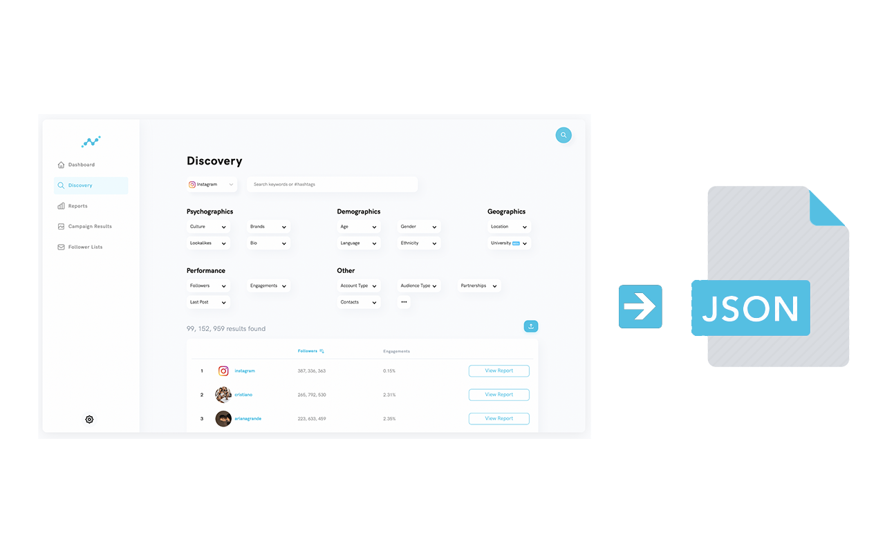

# Tensor Query

Chrome extension to save [Tensor Social](https://tensorsocial.com/) query locally for the API interaction.

> [More info in the "Marketing platforms" section](https://tracking-influencers.com/docs/platform-and-accounts-selection#social-media-marketing-platforms)

## Disclaimer

The use of the research software provided in this release is done at your own discretion and risk and you will be solely responsible for any damage to your computer system or loss of data that results from such activities. You are solely responsible for adequate protection and backup of the data and equipment used in connection with research software.

The research software may contain links to external websites that are not provided or maintained by it and does not guarantee the accuracy, relevance, timeliness, or completeness of any information on these external websites.

You are solely responsible for determining the appropriateness of using and distributing the research software and you assume all risks associated with its use.
